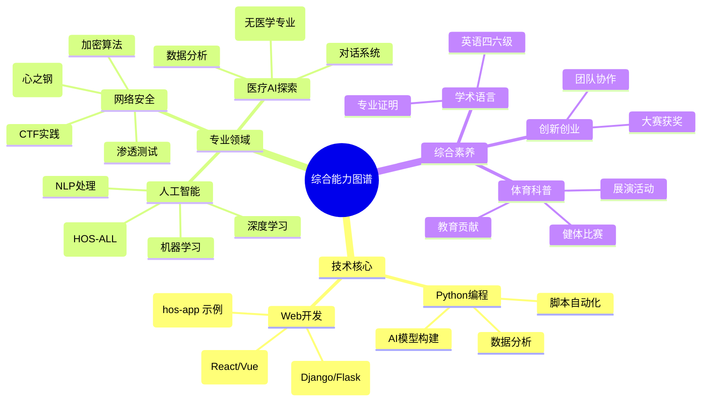

# RES-PJEXP 个人成果档案
## 📁 档案概述
RES-PJEXP 是钱佳宏的个人技术成果和证书档案库，主要用于存储和展示在网络安全、人工智能、医疗健康等领域的学习成果、竞赛证书和技术认证。该档案库定期更新，以反映最新的成就和项目进展。

## 📊 成果展示
### 证书认证
- 多项技术认证获得：包括Intel和携程证书
- 各类竞赛奖项：国/市级创新创业和科普奖
- 学术成绩证明：英语四六级通过

### 综合能力
- 创新创业能力展示：参与创新大赛并获奖
- 体育健康活动参与：健体比赛获奖
- 科普教育贡献：展演活动证书

## 💼 技术技能
### 涉及技术领域
- Python编程：用于脚本开发、数据分析和AI模型构建
- Web开发技术：包括前端框架和后端服务
- 网络安全知识：渗透测试、加密算法和安全审计
- 人工智能基础：机器学习、深度学习和自然语言处理
- 医疗数据分析：生物信息学工具和健康数据可视化（以AI视角为主）

### 在线技术 profiles
为了更好地展示技术贡献和开源项目，以下是我的在线平台链接及其内容总结。这些平台展示了我在安全、AI和相关领域的初步探索和贡献：

- **PyPI 用户页面**：作为 security_hyacinth 用户，我在 PyPI 上注册了账户，用于未来发布 Python 包，专注于安全工具和AI辅助库。目前尚未发布具体包，但计划用于分享开源安全模块。[访问 PyPI 页面](https://pypi.org/user/security_hyacinth/)
- **GitHub 仓库**：我的主要代码仓库，包含各种项目从网络安全工具到AI实验。目前有几个仓库，包括 pinned 项目：hos-app（一个由三人完成的训练营前端项目，展示 Web 开发技能）；HOS-ALL（一个由五人完成的 AI + 信息安全项目，参与 Intel AI 竞赛，使用 Python 实现）。这些项目突显了在 AI 和安全领域的团队协作和创新实践。[访问 GitHub](https://github.com/lxcxjxhx)
- **Hugging Face 模型库**：分享了训练好的AI模型，特别是医疗和自然语言处理相关的模型。目前 profile 存在，但尚未上传具体模型或数据集，未来将用于发布 AI 实验成果。[访问 Hugging Face](https://huggingface.co/lxcxjxhx)
- **CSDN 博客**：作为 security-hyacinth 的博客空间，用于分享技术文章，覆盖网络安全、AI、编程等主题。目前博客内容尚未公开或正在建设中，计划用于记录学习心得和项目总结。[访问博客](https://security-hyacinth.blog.csdn.net/)

综合能力图谱

## 📞 联系信息
- **档案所有者**: 钱佳宏
- **联系方式(手机号&邮箱）**: 19921057118 && aqfxz_zh@qq.com
- **内容**: 个人学习成果和证书档案

## 🙏 致谢
感谢所有做出贡献的团队成员、指导老师以及支持我们的组织机构。

