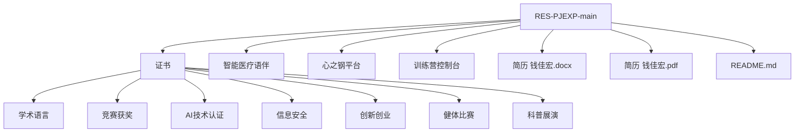
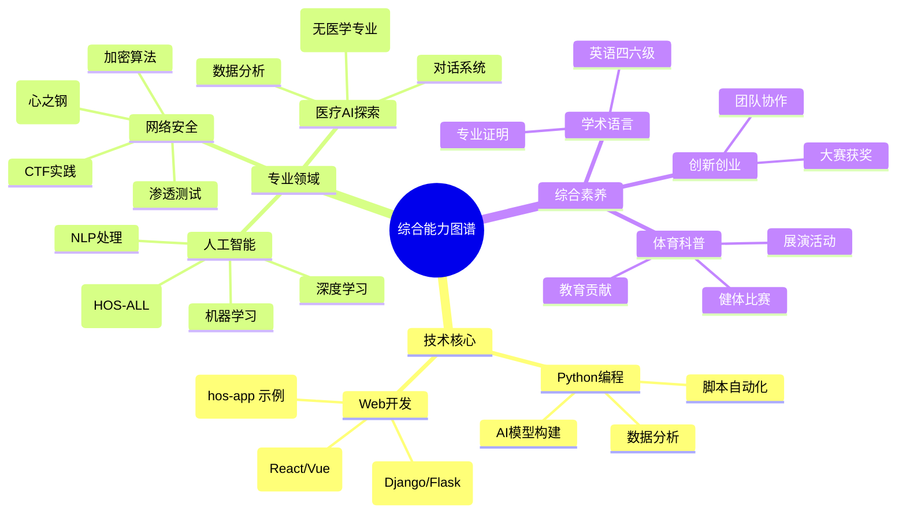

# RES-PJEXP 个人成果档案
## 📁 档案概述
RES-PJEXP 是钱佳宏的个人技术成果和证书档案库，主要用于存储和展示在网络安全、人工智能、医疗健康等领域的学习成果、竞赛证书和技术认证。该档案库定期更新，以反映最新的成就和项目进展。

## 📋 内容分类
### 🔒 网络安全相关
- **心之钢平台**: 一个专注于网络安全的学习和实践平台，提供资源和工具支持。[访问平台](https://www.cbloghyrj365.us/)
- **训练营控制台**: 用于网络安全训练营的控制台界面，IP地址：8.153.78.140
- CTF竞赛相关材料，包括挑战题解和实践笔记

### 🏥 医疗技术探索
- **智能医疗语伴**: 聚焦于AI方向的搭建，开发智能对话系统用于医疗场景的应用支持（详情暂未公开，强调AI技术而非医学专业内容）
- 医疗数据分析学习资料，包括数据集处理和模型训练示例（以AI工具为主，无深入医学知识涉及）

### 🏆 证书与荣誉
个人在多个领域获得的学习成果和认证。根据最新文件内容（GitHub仓库证书文件夹），证书分类保持稳定，无重大新增子文件夹或文件变化。现有证书包括：

#### 📚 学术与语言能力
- 大学英语四六级成绩认证（CET-4 和 CET-6 证书扫描件）
- 专业学术能力证明，如学业成绩单

#### 🤖 AI与技术创新
- 国内外AI技术认证（如 Coursera 或 edX 平台证书）
- 信息安全专业证书（如 CompTIA Security+ 等）
- Intel技术认证（如 AI 开发者证书）
- 携程训练营结营证书

#### 🏅 综合能力展示
- 健体比赛获奖证书（如校园体育赛事奖项）
- 科普展演活动证书（如科技科普演讲奖）
- 市级各类竞赛荣誉（如创新创业大赛奖项）

## 💼 技术技能
### 涉及技术领域
- Python编程：用于脚本开发、数据分析和AI模型构建
- Web开发技术：包括前端框架和后端服务
- 网络安全知识：渗透测试、加密算法和安全审计
- 人工智能基础：机器学习、深度学习和自然语言处理
- 医疗数据分析：生物信息学工具和健康数据可视化（以AI视角为主）

### 在线技术 profiles
为了更好地展示技术贡献和开源项目，以下是我的在线平台链接及其内容总结。这些平台展示了我在安全、AI和相关领域的初步探索和贡献：

- **PyPI 用户页面**：作为 security_hyacinth 用户，我在 PyPI 上注册了账户，用于未来发布 Python 包，专注于安全工具和AI辅助库。目前尚未发布具体包，但计划用于分享开源安全模块。[访问 PyPI 页面](https://pypi.org/user/security_hyacinth/)
- **GitHub 仓库**：我的主要代码仓库，包含各种项目从网络安全工具到AI实验。目前有几个仓库，包括 pinned 项目：hos-app（一个由三人完成的训练营前端项目，展示 Web 开发技能）；HOS-ALL（一个由五人完成的 AI + 信息安全项目，参与 Intel AI 竞赛，使用 Python 实现）。这些项目突显了在 AI 和安全领域的团队协作和创新实践。[访问 GitHub](https://github.com/lxcxjxhx)
- **Hugging Face 模型库**：分享了训练好的AI模型，特别是医疗和自然语言处理相关的模型。目前 profile 存在，但尚未上传具体模型或数据集，未来将用于发布 AI 实验成果。[访问 Hugging Face](https://huggingface.co/lxcxjxhx)
- **CSDN 博客**：作为 security-hyacinth 的博客空间，用于分享技术文章，覆盖网络安全、AI、编程等主题。目前博客内容尚未公开或正在建设中，计划用于记录学习心得和项目总结。[访问博客](https://security-hyacinth.blog.csdn.net/)

## 📁 档案结构
以下是档案的树状结构可视化，使用 Mermaid 图表展示，便于直观理解：

- **证书/**：个人证书文件，按领域分类存储
  - 学术语言/：四六级等语言证书
  - 竞赛获奖/：各类竞赛获奖证书
  - AI技术认证/：AI相关技术认证
  - 信息安全/：网络安全认证
  - 创新创业/：创新大赛证书
  - 健体比赛/：体育竞赛证书
  - 科普展演/：科普活动证书
- **智能医疗语伴/**：医疗AI相关材料
- **心之钢平台/**：网络安全相关材料
- **训练营控制台/**：训练营学习材料
- **简历 钱佳宏.docx**：个人简历文档（Word 格式）
- **简历 钱佳宏.pdf**：个人简历PDF
- **README.md**：档案说明文档

## 📖 使用说明
### 浏览方式
1. 直接查看各文件夹中的证书和材料文件
2. PDF和图片文件可直接打开查看
3. 文档文件可使用相应软件（如 Microsoft Word）打开

### 文件格式
- 📄 PDF文档：证书、成绩单等正式文件
- 🖼️ 图片文件：获奖证书扫描件、活动照片
- 📝 文档文件：简历、说明文档

## 📊 成果展示
### 技术学习
- 网络安全知识学习和实践：参与CTF竞赛和平台开发
- AI技术探索和应用：构建医疗AI模型，并在Hugging Face分享
- 医疗数据分析研究：使用Python分析健康数据集（AI导向）

### 证书认证
- 多项技术认证获得：包括Intel和携程证书
- 各类竞赛奖项：市级创新创业和科普奖
- 学术成绩证明：英语四六级高分通过

### 综合能力
- 创新创业能力展示：参与创新大赛并获奖
- 体育健康活动参与：健体比赛获奖
- 科普教育贡献：展演活动证书

以下是综合能力图谱，使用扩展的 Mermaid 思维导图凸显多领域技能关联和深度，便于视觉化理解核心竞争力：

## 📞 联系信息
- **档案所有者**: 钱佳宏
- **内容**: 个人学习成果和证书档案

## 🙏 致谢
感谢所有做出贡献的团队成员、指导老师以及支持我们的组织机构。

---
⭐ 如果这个项目对您有帮助，请给它一个star！
