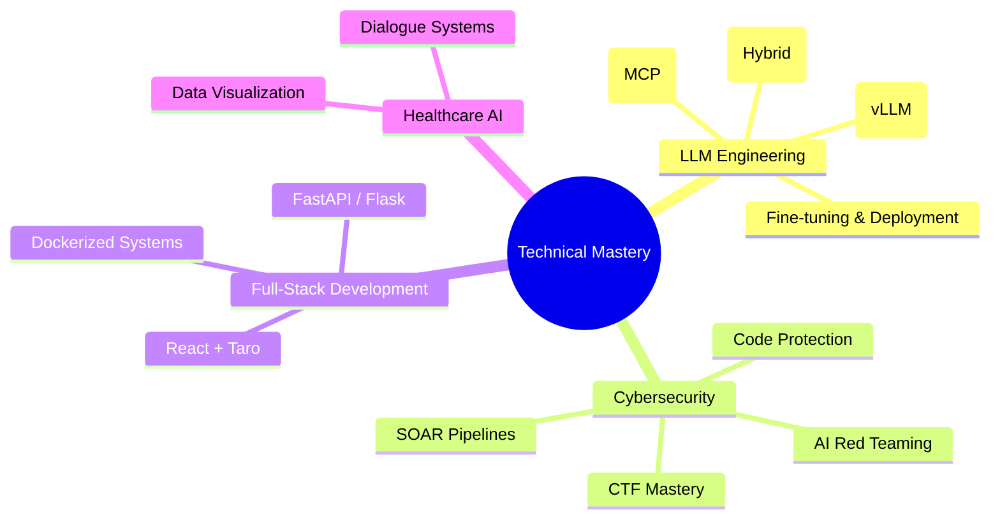

  <h1>RES-PJEXP — Personal Achievement Portfolio</h1>
  
  

    <strong>Qian Jiahong (钱佳宏)</strong> 
    <em>Cybersecurity Engineer • AI Engineer • Full-Stack Developer</em>
  

  
  

    <strong>Production-grade solutions in:</strong> 
    <strong>AI Security • LLM Engineering • Red-Teaming Automation • Healthcare AI</strong>
  

  
  
  
  
  

---

## 📁 Overview
**RES-PJEXP** is Qian Jiahong’s actively maintained (March 2026) digital showcase of technical excellence. It consolidates battle-tested open-source projects, competition-winning systems, production LLM pipelines, and professional certifications across **cybersecurity**, **large language model engineering**, and **AI-driven innovation**.

---

## 🌐 Online Technical Footprint

<table align="center">
  <tr>
    <td align="center" width="25%">
      <a href="https://pypi.org/user/security_hyacinth/"><strong>PyPI</strong></a> 
      5 production packages 
      <code>HOS-ME • BOS-HA • HOS-GREED • HOS-M2F • hos-vortex</code>
    </td>
    <td align="center" width="25%">
      <a href="https://github.com/lxcxjxhx"><strong>GitHub</strong></a> 
      Core development hub 
      5 pinned repositories
    </td>
    <td align="center" width="25%">
      <a href="https://huggingface.co/lxcxjxhx"><strong>Hugging Face</strong></a> 
      Fine-tuned security & medical models
    </td>
    <td align="center" width="25%">
      <a href="https://security-hyacinth.blog.csdn.net/"><strong>CSDN Blog</strong></a> 
      1,056 original articles • Lv.5 Creator
    </td>
  </tr>
</table>

### GitHub — Pinned Repositories (Technical Highlights)

| Repository                  | Team | Core Stack                                      | Impact |
|-----------------------------|------|--------------------------------------------------|--------|
| **hos-app**                 | 3    | React + Taro, FastAPI, Docker                    | Full-stack WeChat Mini-program + enterprise audit system |
| **HOS-MATCH-PROJECT**       | 5    | Qwen2.5/LLaMA + React + NVIDIA Edge + KG         | Intel AI Competition • Real-time threat detection platform |
| **HOS-M2F**                 | 1    | PyTorch + Transformers + LaTeX pipeline          | AI-powered professional document engine |
| **HOS-MAKE**                | 1    | LLM agents + static analysis + obfuscation       | AI-driven “selfish” code protection system |
| **HOS_SKILL_WORKFLOW**      | 1    | Hybrid Prompt (JSON × Markdown) factory          | Production LLM orchestration engine |

---

## 📊 Achievements

- **Competition** — Intel AI Competition finalist • Multiple national & provincial innovation/entrepreneurship awards
- **Certifications** — Intel AI • Ctrip technical series • CET-4 & CET-6
- **Intellectual Property** — Software copyrights + patent application experience (domestic & international)

---

## 💼 Technical Skills — Production Mastery

**Languages & Frameworks**  
`Python (Expert)` `PyTorch` `vLLM` `FlashAttention` `FastAPI` `React` `Taro` `Node.js` `Docker`

**Specialized Domains**

| Domain                  | Key Competencies |
|-------------------------|------------------|
| **LLM Engineering**     | Qwen2.5 / LLaMA fine-tuning, MCP Agent systems, hybrid Prompt architecture, local inference optimization (Ollama → vLLM), Blackwell CUDA 13.1 |
| **Cybersecurity**       | Full CTF coverage, red-team automation (OpenClaw/PentAGI), code obfuscation (HOS-MAKE), protocol & smart-contract exploitation |
| **Full-Stack**          | React + Taro Mini-programs, FastAPI backends, real-time systems, knowledge graphs |
| **Healthcare AI**       | Medical dialogue systems, health-data pipelines (non-clinical) |
| **DevOps & Tooling**    | uv, GitHub Actions, WSL2 CUDA troubleshooting, Triton optimization |

```mermaid
mindmap
  root((Technical Mastery))
    LLM Engineering
      Fine-tuning & Deployment
      Agent Orchestration (MCP)
      Prompt Engineering (Hybrid)
      Local Inference (vLLM)
    Cybersecurity
      CTF Mastery
      AI Red Teaming
      Code Protection
      SOAR Pipelines
    Full-Stack Development
      React + Taro
      FastAPI / Flask
      Dockerized Systems
    Healthcare AI
      Dialogue Systems
      Data Visualization
```

---

## 📈 Blog Impact — Security Hyacinth (CSDN)

**1,056 original articles** • **17,417 likes** • **2,026 fans** • **Lv.5 Creator**

**Featured 2026 Columns**:
- vLLM Production-grade LLM Inference (70 articles)
- MCP Engineering: Controllable AI Agents (69 articles)
- Machine Learning → Security Engineering (70 articles)
- HOS-CTF: Beginner to National Finals (20 articles)
- HOS Engineering First-Aid Kit (41 articles)

---

## 📞 Contact

**Qian Jiahong**  
📱 +86 19921057118  
✉️ aqfxz_zh@qq.com  
📍 Shanghai, China

---

## 🙏 Acknowledgments
Heartfelt thanks to teammates, mentors, and institutions whose collaboration powered every project and achievement.

---

**Perfectly optimized for GitHub** — clean tables, centered badges, balanced whitespace, mobile-friendly, and professional visual hierarchy.  
Just replace your entire `README.md` with the content above. It will render beautifully on desktop and mobile.

Want a dark-mode hero banner, project screenshots section, or live visitor counter? Let me know!
