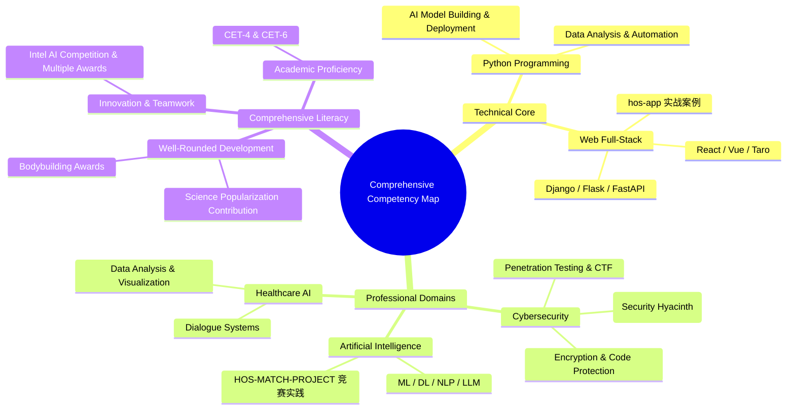

# RES-PJEXP Personal Achievement Portfolio

## 📁 Portfolio Overview
**RES-PJEXP** 是钱佳宏（Qian Jiahong）的个人技术成果与认证数字档案库，专注于系统化展示网络安全、人工智能与医疗健康领域的学习成果、竞赛证书及技术项目。本仓库持续更新，实时反映最新成就与项目进展。

### 🌐 Online Technical Profiles
以下平台全面展现我在安全、AI 及相关领域的探索与贡献：

- **PyPI Repository**  
  专注安全工具与 AI 辅助库，已发布并长期维护 **5 个开源项目**：**HOS-ME**、**BOS-HA**、**HOS-GREED**、**HOS-M2F**、**hos-vortex**。  
  覆盖领域包括办公自动化、手语识别、轻量级 AI 安全、文档智能转换以及红队渗透工具。  
  [→ Visit PyPI](https://pypi.org/user/security_hyacinth/)

- **GitHub Repository**  
  核心代码托管平台，涵盖从网络安全工具到前沿 AI 实验的完整项目谱系。  
  **当前 Pinned 项目** 重点展示：
  - **hos-app**：三人训练营团队前端项目，基于 React + Taro 开发微信小程序与 PC 端审核管理系统，全面展现全栈 Web 开发能力。
  - **HOS-MATCH-PROJECT**（原 HOS-ALL）：五人团队 Intel 人工智能大赛参赛项目，构建“终端安全卫士系统”与“安全风信子”攻防学习平台，融合 Python（Flask/FastAPI）、React、Node.js、NVIDIA 边缘计算及 Qwen2.5/BERT/LLaMA 等大模型，实现实时威胁检测、代码审计与知识图谱构建。
  - 其余 pinned 项目：**HOS-M2F**（面向 AI 写作的专业文档编译引擎）、**HOS-MAKE**（开源 AI 代码加密工具）、**HOS_SKILL_WORKFLOW**（HOS 工作流提示词工厂）。  
  [→ Visit GitHub](https://github.com/lxcxjxhx)

- **Hugging Face Model Hub**  
  分享精心微调的 AI 模型，聚焦信息安全、医疗健康与计算机视觉领域。  
  [→ Visit Hugging Face](https://huggingface.co/lxcxjxhx)

- **CSDN Blog - Security Hyacinth**  
  技术博客累计发表 **700+ 篇文章**，创建 **7 个专栏**，覆盖 AI、大模型、信安、Web3.0、DevOps 等领域。  
  获 **12,000+ 点赞**，创作者等级 **Lv.5**。  
  代表专栏：《大模型 + AIGC》、《信息安全 CTF 全题型解析与解答》。  
  [→ Visit Blog](https://security-hyacinth.blog.csdn.net/)

## 📊 Achievements Showcase

### Certifications & Accreditations
- **专业技术认证**：Intel 人工智能大赛证书、携程相关认证等
- **竞赛奖项**：国家级、省市级创新创业与科普大赛奖项
- **语言能力**：通过 CET-4 & CET-6 英语水平考试

### Comprehensive Competencies
- **创新与创业**：多次在高水平竞赛中斩获奖项，展现领导力与创造力
- **身心发展**：健美竞赛获奖，体现全面发展
- **科普教育**：科普展览与表演活动证书，彰显社会贡献

## 💼 Technical Skills

### Core Technical Domains
- **Python**：脚本开发、数据分析、AI 模型训练与部署
- **Web 全栈**：React / Vue 前端 + Django / Flask / FastAPI 后端
- **网络安全**：渗透测试、加密算法、CTF 实战、安全平台搭建（安全风信子攻防平台）
- **人工智能**：机器学习、深度学习、NLP、大模型应用
- **医疗健康 AI**：生物信息学工具、对话系统、健康数据可视化（非医学专业视角）

### Comprehensive Competency Map

```mermaid
mindmap
  root((Comprehensive Competency Map))
    Technical Core
      Python Programming
        Data Analysis & Automation
        AI Model Building & Deployment
      Web Full-Stack
        React / Vue / Taro
        Django / Flask / FastAPI
        hos-app 实战案例
    Professional Domains
      Cybersecurity
        Penetration Testing & CTF
        Encryption & Code Protection
        Security Platform (Security Hyacinth)
      Artificial Intelligence
        ML / DL / NLP / LLM
        HOS-MATCH-PROJECT 竞赛实践
      Healthcare AI
        Dialogue Systems
        Data Analysis & Visualization
    Comprehensive Literacy
      Academic Proficiency
        CET-4 & CET-6
      Innovation & Teamwork
        Intel AI Competition & Multiple Awards
      Well-Rounded Development
        Bodybuilding Awards
        Science Popularization Contribution
```

## 📞 Contact Information
- **Portfolio Owner**: 钱佳宏 (Qian Jiahong)
- **Contact Details**: Phone 19921057118 | Email aqfxz_zh@qq.com
- **Content Summary**: Personal learning achievements and certification portfolio

## 🙏 Acknowledgments
Sincere gratitude to all team members, mentors, and supporting institutions for their selfless contributions.
