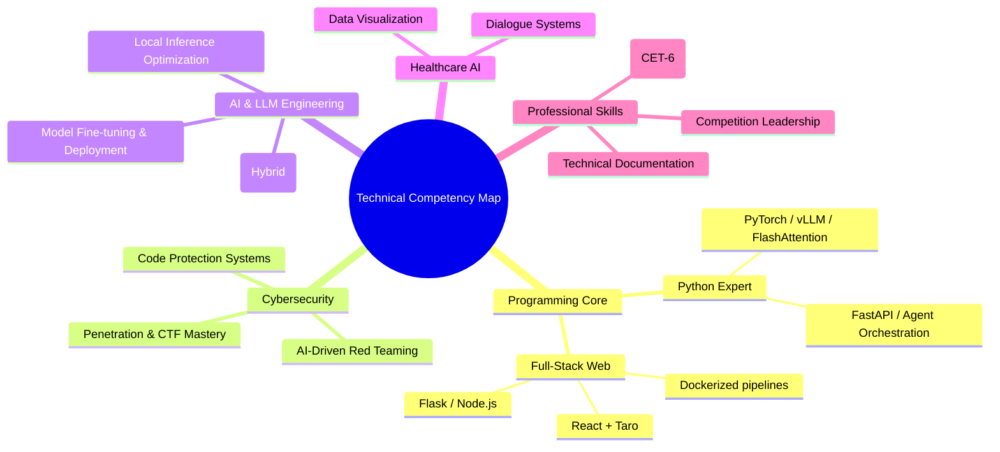

  <h1>RES-PJEXP — Personal Achievement Portfolio</h1>
  
<strong>Qian Jiahong (钱佳宏)</strong>

  
<em>Cybersecurity Engineer • AI Engineer • Full-Stack Developer</em>

  
Showcasing production-grade projects, open-source contributions, and technical excellence in <strong>AI Security • LLM Engineering • Cybersecurity • Healthcare AI</strong>

---

## 📁 Portfolio Overview
**RES-PJEXP** is Qian Jiahong’s comprehensive digital portfolio that systematically documents technical achievements, open-source projects, competition results, and professional certifications.  
The repository is actively maintained (updated March 2026) to reflect the latest advancements in **cybersecurity tooling**, **large language model (LLM) engineering**, **AI-driven security platforms**, and **full-stack development**.

---

## 🌐 Online Technical Profiles

- **PyPI — Security Hyacinth**  
  Published and actively maintained **5 production-grade open-source packages**:  
  `HOS-ME`, `BOS-HA`, `HOS-GREED`, `HOS-M2F`, `hos-vortex`.  
  Domains: office automation pipelines, lightweight sign-language recognition, AI-powered red-team penetration tools, intelligent document conversion engines, and secure code obfuscation systems.  
  [→ Visit PyPI](https://pypi.org/user/security_hyacinth/)

- **GitHub — Core Development Hub**  
  Central code repository hosting battle-tested projects across security, AI, and full-stack domains.  
  **Currently pinned repositories** (technical highlights):

  | Repository              | Team Size | Core Technologies                                      | Key Achievements |
  |-------------------------|-----------|--------------------------------------------------------|------------------|
  | **hos-app**             | 3         | React + Taro, FastAPI, PostgreSQL, Docker              | Full-stack WeChat Mini-program + PC audit system |
  | **HOS-MATCH-PROJECT** (ex-HOS-ALL) | 5 | Python (Flask/FastAPI), React, Node.js, Qwen2.5/BERT/LLaMA, NVIDIA Edge, Knowledge Graph | Intel AI Competition finalist • Real-time threat detection + automated code auditing platform |
  | **HOS-M2F**             | 1         | PyTorch, Transformers, LaTeX pipeline                  | Professional AI writing → document compilation engine |
  | **HOS-MAKE**            | 1         | LLM agents, code obfuscation, static analysis          | AI-driven “selfish” code protection system |
  | **HOS_SKILL_WORKFLOW**  | 1         | Prompt engineering factory, JSON/Markdown hybrid       | Production-grade LLM skill orchestration |

  [→ Visit GitHub](https://github.com/lxcxjxhx)

- **Hugging Face Model Hub**  
  Curated collection of fine-tuned models focused on **information security**, **medical dialogue systems**, and **computer vision**.  
  [→ Visit Hugging Face](https://huggingface.co/lxcxjxhx)

- **CSDN Blog — Security Hyacinth**  
  Technical blog with **1,056 original articles** (as of Mar 2026).  
  **Platform Stats**:

  | Metric                  | Value          |
  |-------------------------|----------------|
  | Original Articles       | **1,056**      |
  | Total Likes             | **17,417**     |
  | Fans                    | **2,026**      |
  | Columns                 | **11**         |
  | Creator Level           | **Lv.5**       |
  | Total Page Views        | 937,792        |

  **Featured Columns** (selected technical depth):
  - HOS-CTF | From Beginner to National Competition (20 articles)
  - vLLM Production-grade LLM Inference Engine (2026) (70 articles)
  - MCP Engineering: Building Controllable AI Agents (69 articles)
  - Machine Learning: From Mathematical Intuition to Security Engineering (70 articles)
  - Master YOLO: Zero-to-Industrial Object Detection (10 articles)
  - 2025 Large Models + AIGC (165 articles)
  - 2025 Information Security CTF Full Question Types & Solutions (160 articles)
  - HOS Engineering First-Aid Kit (Git/Python/AI env troubleshooting) (41 articles)

  Recent 2026 posts cover OpenClaw automation, PentAGI AI pentesting, flash-attention/vLLM installation pipelines, Blackwell CUDA 13.1 adaptation, and advanced Prompt engineering (JSON vs Markdown hybrid architectures).  
  [→ Visit Blog](https://security-hyacinth.blog.csdn.net/)

---

## 📊 Technical Achievements & Certifications

- **Competition Awards**  
  Intel AI Competition (team project) • Multiple national/provincial innovation & entrepreneurship awards • Science popularization excellence certificates.

- **Professional Certifications**  
  Intel AI • Ctrip technical series • CET-4 & CET-6 (English proficiency).

- **Intellectual Property**  
  Multiple software copyrights and patent application experience (domestic & international strategies).

---

## 💼 Technical Skills — Balanced Mastery

### Core Programming & Frameworks
- **Python** (expert): Data pipelines, PyTorch/TensorFlow, vLLM, FlashAttention, Ollama, LangChain, FastAPI/Flask, CUDA 13.1 optimization
- **Web Full-Stack**: React, Vue, Taro (WeChat Mini-programs), Django, Node.js, Tailwind, Docker/K8s basics
- **Frontend/Backend Integration**: Real-time systems, knowledge graphs, multi-agent orchestration

### Cybersecurity & Red-Teaming
- Penetration testing, CTF (all question types), protocol & smart-contract vulnerability exploitation
- Code obfuscation & protection (HOS-MAKE), automated security auditing, OpenClaw-style SOAR pipelines
- “Security Hyacinth” attack-defense learning platform architecture

### Artificial Intelligence & LLM Engineering
- Machine Learning / Deep Learning / NLP
- Large Model fine-tuning & deployment (Qwen2.5, LLaMA, BERT)
- Prompt engineering (rational × emotional hybrid systems), Agent frameworks (MCP)
- Local AI deployment (Ollama → vLLM full-stack pipelines), GPU troubleshooting (Blackwell, WSL2 CUDA, Triton)

### Healthcare AI (Non-clinical Perspective)
- Medical dialogue systems, bioinformatics visualization, health-data pipelines

### Additional Competencies
- Prompt-to-Production workflows, environment automation (uv, conda-forge, GitHub Actions)
- Technical writing & knowledge dissemination (700+ blog posts, 11 columns)

```mermaid
mindmap
  root((Technical Competency Map))
    Programming Core
      Python Expert
        PyTorch / vLLM / FlashAttention
        FastAPI / Agent Orchestration
      Full-Stack Web
        React + Taro
        Flask / Node.js
        Dockerized pipelines
    Cybersecurity
      Penetration & CTF Mastery
      AI-Driven Red Teaming
      Code Protection Systems
    AI & LLM Engineering
      Model Fine-tuning & Deployment
      Prompt Engineering (Hybrid)
      Local Inference Optimization
    Healthcare AI
      Dialogue Systems
      Data Visualization
    Professional Skills
      Competition Leadership
      Technical Documentation
      English Proficiency (CET-6)
```

## 📞 Contact Information
- **Portfolio Owner**: 钱佳宏 (Qian Jiahong)
- **Contact Details**: Phone 19921057118 | Email aqfxz_zh@qq.com
- **Location**: Shanghai, China
- **Content Summary**: Personal learning achievements and certification portfolio

## 🙏 Acknowledgments
Sincere gratitude to all team members, mentors, and supporting institutions for their selfless contributions.
