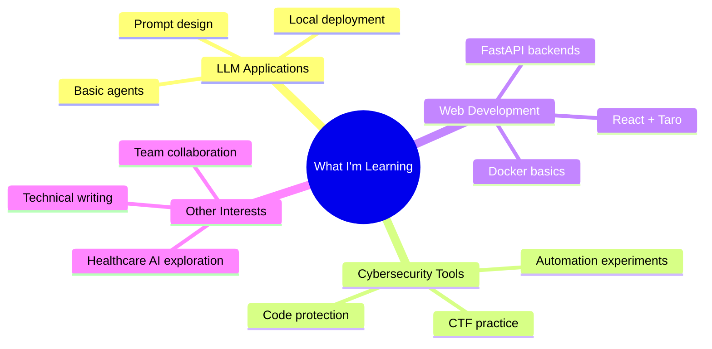

  <h1>RES-PJEXP — Personal Achievement Portfolio</h1>
 
  

    <strong>Qian Jiahong (钱佳宏)</strong> 
    <em>Passionate Learner in Cybersecurity, AI, and Full-Stack Development</em>
  

 
  

    A curated collection of personal projects, open-source contributions, competition experiences, 
    and learning outcomes in <strong>AI Security • LLM Applications • Cybersecurity Tools • Healthcare AI Exploration</strong>. 
    Continuously updated as I keep learning and building (April 2026).
  

  
  
  
  
  
  
  
  
  

---
## 📁 Overview
**RES-PJEXP** serves as my personal digital archive to organize and share the projects, certifications, and learning journeys I have been working on. It focuses on practical applications in cybersecurity, large language models, and AI-assisted tools, while reflecting my ongoing growth as a developer.
---
## 🌐 Online Technical Footprint
<table align="center">
  <tr>
    <td align="center" width="25%">
      <a href="https://pypi.org/user/security_hyacinth/"><strong>PyPI</strong></a> 
      7 open-source packages 
      <code>hos-m2f • gradio-gradiohossec • HOS-SECSUITE • HOS-ME • BOS-HA • HOS-GREED • hos-vortex</code>
    </td>
    <td align="center" width="25%">
      <a href="https://github.com/lxcxjxhx"><strong>GitHub</strong></a> 
      Main development space 
      Several pinned repositories
    </td>
    <td align="center" width="25%">
      <a href="https://huggingface.co/lxcxjxhx"><strong>Hugging Face</strong></a> 
      Fine-tuned models for security & healthcare exploration
    </td>
    <td align="center" width="25%">
      <a href="https://security-hyacinth.blog.csdn.net/"><strong>CSDN Blog</strong></a> 
      1,341 original articles • Lv.6 Creator
    </td>
  </tr>
</table>

### GitHub — Pinned Repositories (Selected Projects)
| Repository              | Team | Technologies Used                          | What I Worked On |
|-------------------------|------|--------------------------------------------|------------------|
| **HOS-LS**              | 1    | Python, Docker, Multi-Agent AI, RAG       | AI-driven code security analysis and attack-chain inference system |
| **HOS_SKILL_WORKFLOW**  | 1    | Prompt engineering (JSON + Markdown)      | Workflow helper for LLM tasks |
| **HOS-MATCH-PROJECT**   | 5    | Qwen2.5/LLaMA, React, NVIDIA Edge, Knowledge Graph | Intel AI Competition entry – threat detection exploration |
| **HOS-M2F**             | 1    | PyTorch, Transformers, LaTeX              | AI-assisted document compilation tool |
| **HOS-MAKE**            | 1    | LLM agents, code analysis                 | Simple AI-based code protection experiment |

[→ Full GitHub Profile](https://github.com/lxcxjxhx)
---
## 📊 Achievements & Learning Milestones
- **Competitions** — Participated in Intel AI Competition and several national/provincial innovation events
- **Certifications** — Intel AI related certificates, Ctrip technical series, CET-4 & CET-6
- **Sharing** — 1,341 original blog articles on CSDN, documenting AI×Security practice
---
## 💼 Technical Skills & Experience

**Languages & Tools I Work With**  
`Python` `PyTorch` `vLLM` `FastAPI` `React` `Taro` `Node.js` `Docker` `GitHub Actions`

**Areas I Have Been Exploring**
| Area                        | What I Have Been Doing |
|-----------------------------|------------------------|
| **LLM Applications**        | Fine-tuning & local deployment (Qwen2.5, LLaMA), basic agent experiments, prompt design, GPU environment setup |
| **Cybersecurity**           | CTF practice, simple red-team automation tools, code obfuscation experiments, protocol vulnerability learning |
| **Full-Stack Development**  | Building small-to-medium web and Mini-program projects with React/Taro frontends and FastAPI backends |
| **Healthcare AI Exploration**| Trying dialogue systems and data visualization from a non-clinical perspective |
| **DevOps & Troubleshooting**| Setting up local AI environments, CUDA/WSL2 fixes, package management with uv |

```mermaid
mindmap
  root((What I'm Learning))
    LLM Applications
      Local deployment
      Prompt design
      Basic agents
    Cybersecurity Tools
      CTF practice
      Automation experiments
      Code protection
    Web Development
      React + Taro
      FastAPI backends
      Docker basics
    Other Interests
      Healthcare AI exploration
      Technical writing
      Team collaboration
```
---
## 📈 Blog — Security Hyacinth (CSDN)
**1,341 original articles** • **19,268 likes** • **2,622 fans** • **Lv.6 Creator** (as of April 2026)  
Recent topics include Agentic system cost optimization, Multi-Agent security mechanisms, token compression, speculative decoding, red-team tools, and RAG data poisoning defense.  
[→ Visit Blog](https://security-hyacinth.blog.csdn.net/)
---
## 📞 Contact
**Qian Jiahong**  
📱 +86 19921057118  
✉️ aqfxz_zh@qq.com  
📍 Shanghai, China
---
## 🙏 Acknowledgments
Thank you to all teammates, mentors, and friends who have offered guidance and support along this learning journey.
