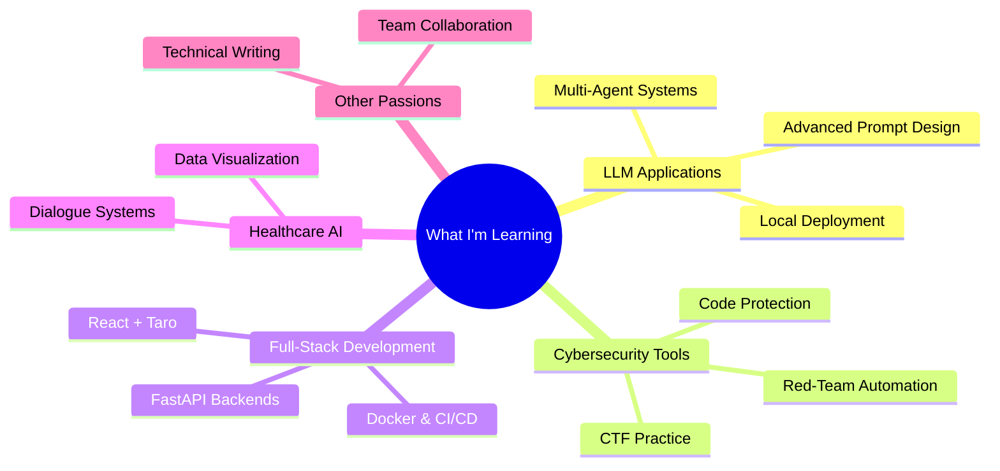

  <h1>RES-PJEXP — Personal Achievement Portfolio</h1>
  

    <strong>Qian Jiahong (钱佳宏)</strong> 
    <em>Passionate Learner & Builder in Cybersecurity, AI, and Full-Stack Development</em>
  

  

    A curated showcase of personal projects, open-source contributions, competition achievements, 
    and hands-on learning in <strong>AI Security • LLM Applications • Cybersecurity Tools • Healthcare AI</strong>. 
    Continuously evolving as I explore and create — <strong>April 2026</strong>
  

  <!-- 新色系技能徽章（Cyber Blue-Purple 主题） -->
  
  
  
  
  
  

  <!-- 项目仓库徽章 -->
  
  
  

---

## 📁 Overview

**RES-PJEXP** 是我的个人数字档案，系统整理并分享我在网络安全、大语言模型和 AI 工具领域的实践项目、开源贡献、竞赛经历与学习成果。这里不仅记录成果，更展现我持续学习、动手实践的成长轨迹。

---

## 🌐 Online Technical Footprint

<table align="center">
  <tr>
    <td align="center" width="25%">
      <a href="https://pypi.org/user/security_hyacinth/"><strong>📦 PyPI</strong></a> 
      <strong>7 个开源包</strong> 
      <small>hos-m2f • gradio-gradiohossec • HOS-SECSUITE • HOS-ME • BOS-HA • HOS-GREED • hos-vortex</small>
    </td>
    <td align="center" width="25%">
      <a href="https://github.com/lxcxjxhx"><strong>🐙 GitHub</strong></a> 
      <strong>主要开发空间</strong> 
      多项仓库置顶 + 活跃贡献
    </td>
    <td align="center" width="25%">
      <a href="https://huggingface.co/lxcxjxhx"><strong>🤗 Hugging Face</strong></a> 
      <strong>微调模型库</strong> 
      安全与医疗领域 LLM 探索
    </td>
    <td align="center" width="25%">
      <a href="https://security-hyacinth.blog.csdn.net/"><strong>📝 CSDN 博客</strong></a> 
      <strong>1,341 篇原创文章</strong> 
      Lv.6 创作者 • 19,268 点赞 • 2,622 粉丝
    </td>
  </tr>
</table>

### GitHub — Pinned Repositories（精选项目）

| Repository          | Team | Technologies                          | My Contributions |
|---------------------|------|---------------------------------------|-------------------|
| **[HOS-LS](https://github.com/lxcxjxhx/HOS-LS)** | 1 | Python, Docker, Multi-Agent AI, RAG | AI 驱动的代码安全分析与攻击链推理系统 |
| **[HOS_SKILL_WORKFLOW](https://github.com/lxcxjxhx/HOS_SKILL_WORKFLOW)** | 1 | Prompt Engineering (JSON + Markdown) | LLM 任务工作流助手 |
| **[HOS-MATCH-PROJECT](https://github.com/lxcxjxhx/HOS-MATCH-PROJECT)** | 5 | Qwen2.5/LLaMA, React, NVIDIA Edge, Knowledge Graph | Intel AI 竞赛作品——威胁检测探索 |
| **[HOS-M2F](https://github.com/lxcxjxhx/HOS-M2F)** | 1 | PyTorch, Transformers, LaTeX | AI 辅助文档编译工具 |
| **[HOS-MAKE](https://github.com/lxcxjxhx/HOS-MAKE)**        | 1 | LLM Agents, Code Analysis            | 简易 AI 代码防护实验 |

[→ 查看完整 GitHub 主页](https://github.com/lxcxjxhx)

---

## 📊 Achievements & Learning Milestones

- **竞赛经历** —— 参加 Intel AI 竞赛及多项国家级/省级创新大赛  
- **认证证书** —— Intel AI 系列证书、携程技术系列、CET-4 & CET-6  
- **知识分享** —— CSDN 1,341 篇原创文章，记录 AI × Security 实战心得

---

## 💼 Technical Skills & Experience

  <strong>Languages & Tools</strong> 
  <code>Python</code> <code>PyTorch</code> <code>vLLM</code> <code>FastAPI</code> <code>React</code> <code>Taro</code> <code>Node.js</code> <code>Docker</code> <code>GitHub Actions</code>

**Core Exploration Areas**

| Area                    | What I Have Been Doing |
|-------------------------|------------------------|
| **LLM Applications**    | Qwen2.5 / LLaMA 微调与本地部署、Agent 实验、Prompt 设计、GPU 环境搭建 |
| **Cybersecurity**       | CTF 实战、红队自动化工具、代码混淆实验、协议漏洞研究 |
| **Full-Stack Development** | React + Taro 前端 + FastAPI 后端，开发中小型 Web 与小程序项目 |
| **Healthcare AI**       | 非临床视角下的对话系统与数据可视化探索 |
| **DevOps & Troubleshooting** | 本地 AI 环境搭建、CUDA/WSL2 问题排查、uv 包管理 |

```mermaid
mindmap
  root((What I'm Learning))
    LLM Applications
      Local Deployment
      Advanced Prompt Design
      Multi-Agent Systems
    Cybersecurity Tools
      CTF Practice
      Red-Team Automation
      Code Protection
    Full-Stack Development
      React + Taro
      FastAPI Backends
      Docker & CI/CD
    Healthcare AI
      Dialogue Systems
      Data Visualization
    Other Passions
      Technical Writing
      Team Collaboration
```

---

## 📈 Blog — Security Hyacinth (CSDN)

**1,378 篇原创文章** • **19,609 个点赞** • **2,743 名粉丝** • **Lv.6 创作者**（截至 2026 年 4 月）

近期热门话题：Agentic 系统成本优化、多智能体安全机制、Token 压缩、推测解码、红队工具、RAG 数据投毒防御。

[→ 立即访问博客](https://security-hyacinth.blog.csdn.net/)

---

## 📞 Contact

**Qian Jiahong**  
📱 +86 19921057118  
✉️ aqfxz_zh@qq.com  
📍 上海，中国

---

## 🙏 Acknowledgments

感谢所有队友、导师和朋友在学习旅程中给予的指导与支持。  
正是因为你们，我才能持续前行。

---

