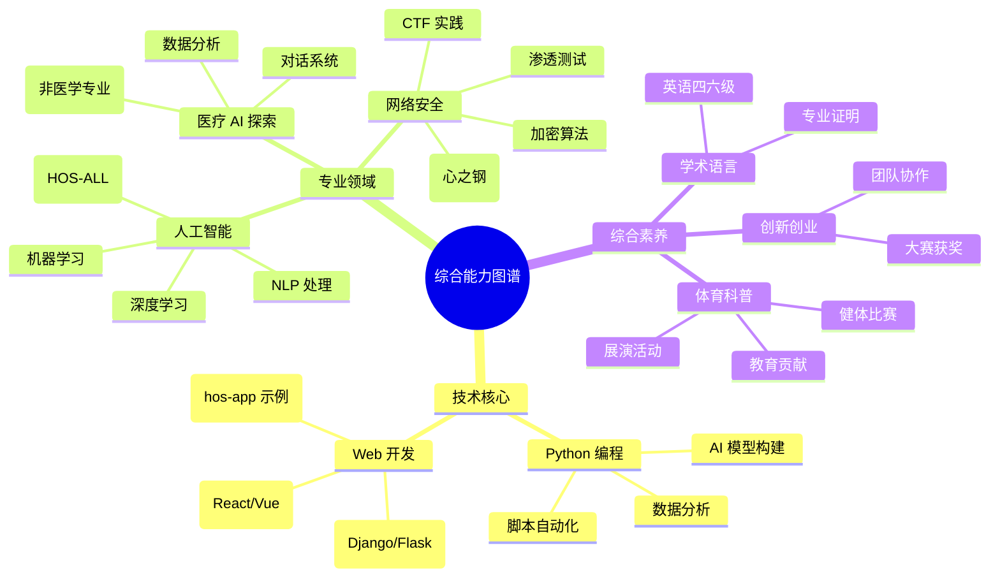

# RES-PJEXP 个人成果档案

## 📁 档案概述
RES-PJEXP 是钱佳宏的个人技术成果与证书档案库，专注于存储和展示在网络安全、人工智能、医疗健康等领域的学习成果、竞赛证书及技术认证。该档案库定期更新，以反映最新成就和项目进展。

### 在线技术 Profiles
为更好地展示技术贡献和开源项目，以下是我的在线平台链接及其关键内容总结。这些平台体现了我在安全、AI及相关领域的探索与贡献：

- **PyPI 仓库**：专注于安全工具和AI辅助库，已发布并维护 HOS-ME、BOS-HA、HOS-GREED、HOS-M2F、hos-vortex 等 5 个开源项目，涵盖办公自动化、手语识别、轻量化AI安全、文档转换及红队渗透等领域。[访问 PyPI 页面](https://pypi.org/user/security_hyacinth/)
- **GitHub 仓库**：核心代码托管平台，包含网络安全工具到AI实验的项目。精选仓库包括 pinned 项目：hos-app（三人团队训练营前端项目，展示 Web 开发技能）；HOS-ALL（五人团队 AI + 信息安全项目，参与 Intel AI 竞赛，使用 Python 实现）。这些项目突出团队协作与创新实践。[访问 GitHub](https://github.com/lxcxjxhx)
- **Hugging Face 模型库**：分享微调后的 AI 模型，聚焦信息安全、医疗及计算机视觉领域。[访问 Hugging Face](https://huggingface.co/lxcxjxhx)
- **CSDN 博客**：以 “security-hyacinth” 身份运营的技术博客，已发布超 700 篇文章，创建 7 个专栏，主题涵盖 AI、信息安全、Web3.0、运维开发等。获超 1.2 万点赞，原力等级 5 级，精选专栏包括“大模型+AIGC”、“信息安全CTF全题型&题解”，持续分享前沿技术洞见与实践。[访问博客](https://security-hyacinth.blog.csdn.net/)

## 📊 成果展示

### 证书认证
- **技术认证**：获得多项认证，包括 Intel 和携程证书。
- **竞赛奖项**：国家级/市级创新创业及科普奖。
- **学术证明**：英语四六级通过。

### 综合能力
- **创新创业**：参与创新大赛并获奖，展示领导力和创意。
- **体育健康**：健体比赛获奖，体现全面发展。
- **科普教育**：展演活动证书，突出教育贡献。

## 💼 技术技能

### 核心技术领域
- **Python 编程**：应用于脚本开发、数据分析及 AI 模型构建。
- **Web 开发**：涵盖前端框架（React/Vue）和后端服务（Django/Flask）。
- **网络安全**：渗透测试、加密算法、安全审计及 CTF 实践。
- **人工智能**：机器学习、深度学习及自然语言处理。
- **医疗数据分析**：生物信息学工具及健康数据可视化（AI 视角）。

### 综合能力图谱

## 📞 联系信息
- **档案所有者**：钱佳宏
- **联系方式**：手机号 19921057118 | 邮箱 aqfxz_zh@qq.com
- **内容概述**：个人学习成果与证书档案

## 🙏 致谢
感谢所有团队成员、指导老师及支持机构的无私贡献。
